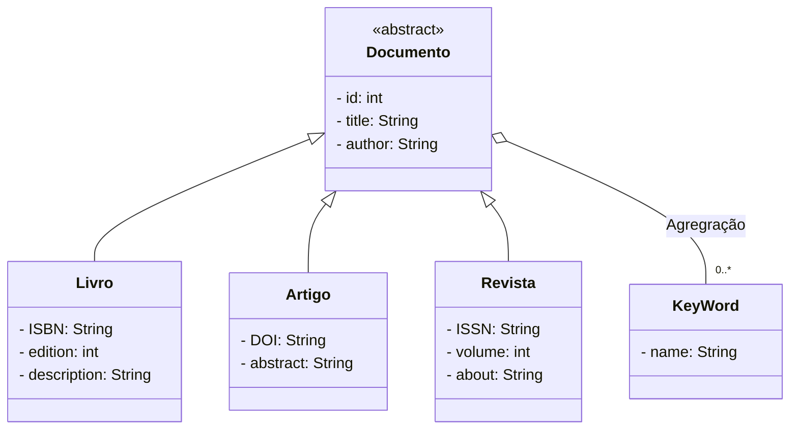

# <h1 style="text-align:center">Alexandria</h1>

  
    
    

        O Alexandria é uma solução abrangente e poderosa para o gerenciamento e compartilhamento de documentos digitais. Com sua interface intuitiva, recursos avançados de busca e capacidade de categorização, ele oferece uma maneira eficiente de organizar, acessar e compartilhar uma vasta gama de materiais, tornando-se uma ferramenta valiosa para estudantes, pesquisadores e entusiastas da leitura.
    

- **Integrantes**: [Ranulfo Mascari Neto](https://github.com/RanulfoMNeto), [Heitor Rodrigues Sabino](https://github.com/s4bino) e [Francisco Afonso de Oliveira Neto](https://github.com/franawp).

## Funcionalidades

- **Usuário**:
    - cadastrar(email/username, senha)
    - login(email/username, senha)
    - editar(Usuário)
    - deletar(Usuário)

- **Gerenciar Palavra-chave**:
    - cadastrar(...)
    - visualizar(Palavra-chave)
    - editar(Palavra-chave)
    - deletar(Palavra-chave)
    
- **Gerenciar Documento**:
    - cadastrar(..., Palavras-chave)
    - visualizar(Documento)
    - editar(Documento)
    - deletar(Documento)

## Usuários Previstos
- **Leitor**(sem cadastro);
- **Usuário**.

## Tecnologias Utilizadas

- **Back-end**:
    - Node JS;
    - TypeScript;
    - Express;
    - Banco de Dados:
        - MongoDB (ou MySQL).

- **Front-end**:
    - HTML;
    - CSS;
    - Bootstap;
    - JavaScript.

## Diagrama UML

