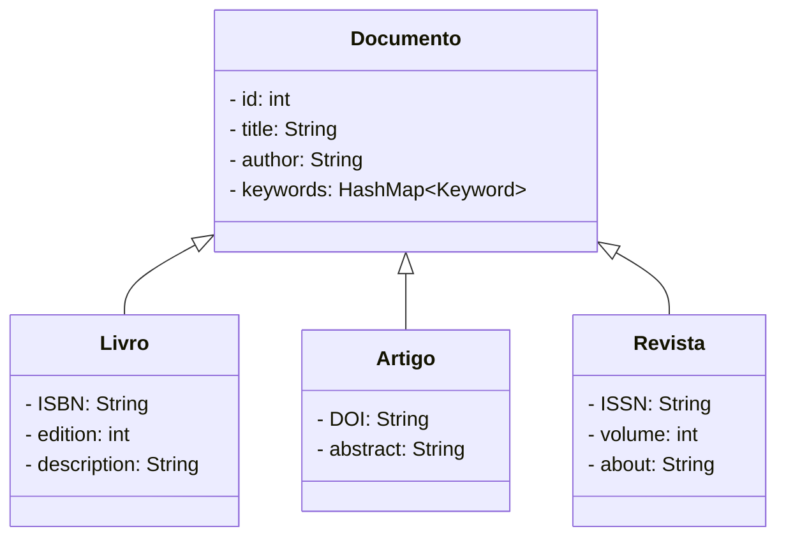

# <h1 style="text-align:center">Alexandria

  
    
    
    O Alexandria é uma solução abrangente e poderosa para o gerenciamento e compartilhamento de documentos digitais. Com sua interface intuitiva, recursos avançados de busca e capacidade de categorização, ele oferece uma maneira eficiente de organizar, acessar e compartilhar uma vasta gama de materiais, tornando-se uma ferramenta valiosa para estudantes, pesquisadores e entusiastas da leitura.

## Funcionalidades

- Usuário:
    - cadastrar(email/username, senha)
    - login(email/username, senha)
    - editar(Usuário)
    - deletar(Usuário)

- Gerenciar Palavra-chave
    - cadastrar(...)
    - visualizar(Palavra-chave)
    - editar(Palavra-chave)
    - deletar(Palavra-chave)
    
- Gerenciar Documento
    - cadastrar(..., Palavras-chave)
    - visualizar(Documento)
    - editar(Documento)
    - deletar(Documento)

## Usuários Previstos
- Usuário;
- Administrador.

## Tecnologias Utilizadas

- Back-end:
    - Node JS;
    - TypeScript;
    - Express;
    - Banco de Dados:
        - MongoDB (ou MySQL).

- Front-end:
    - HTML;
    - CSS;
    - Bootstap;
    - JavaScript.

## Diagrama UML

