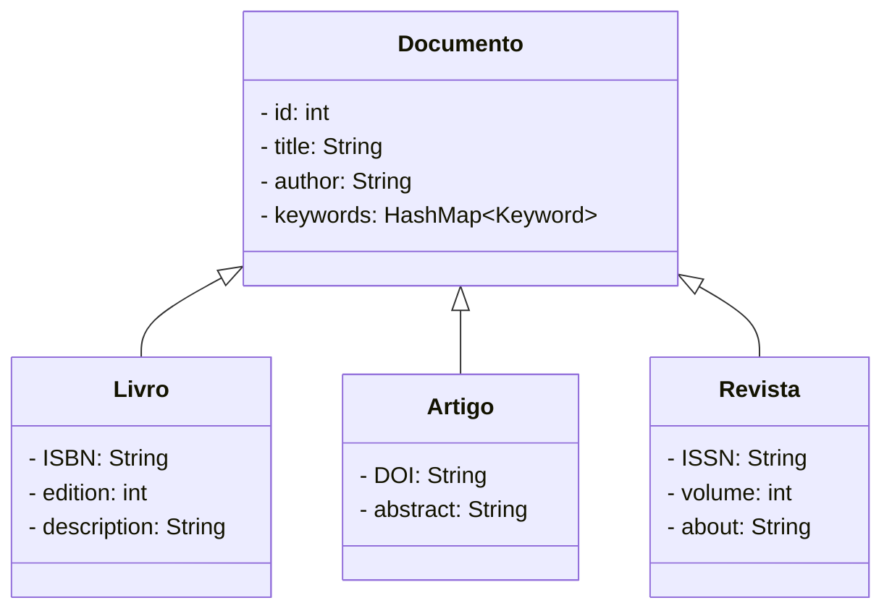

# Alexandria

O Alexandria é uma solução abrangente e poderosa para o gerenciamento e compartilhamento de documentos digitais. Com sua interface intuitiva, recursos avançados de busca e capacidade de categorização, ele oferece uma maneira eficiente de organizar, acessar e compartilhar uma vasta gama de materiais, tornando-se uma ferramenta valiosa para estudantes, pesquisadores e entusiastas da leitura.

### Funcionalidades

- Usuário:
    cadastrar(email/username, senha)

- Gerenciar Documentos
    cadastrar()

