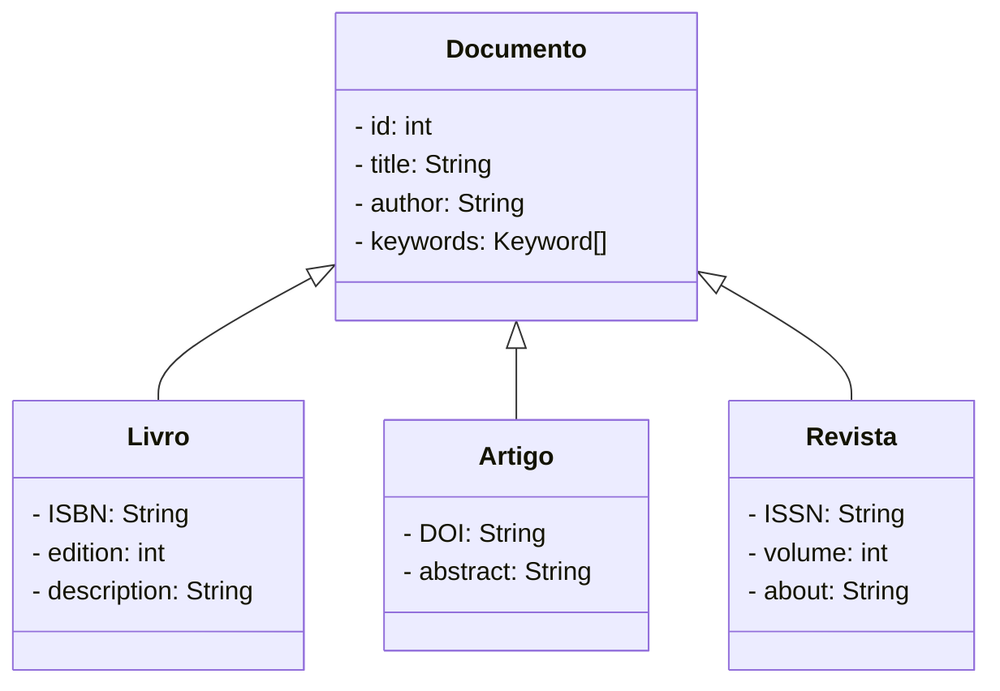

# Diagrama UML

```mermaid
    classDiagram
        Documento <|-- Livro
        Documento <|-- Artigo
        Documento <|-- Revista
        class Documento {
            - id: int
            - title: String
            - author: String
            - keywords: Keyword[]
        }
        class Livro {
            - ISBN: String
            - edition: int
            - description: String
        }
        class Artigo {
            - DOI: String
            - abstract: String
        }
        class Revista {
            - ISSN: String
            - volume: int
            - about: String
        }

```